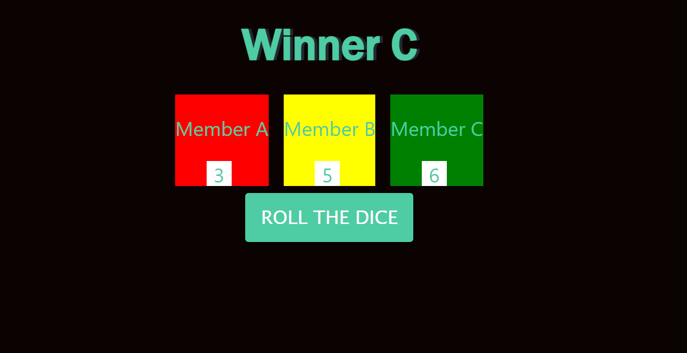

# Dice-Roll-Game
No Greed is a single page, 3-player dice game which showcases my JavaScript logical skills.

## Built With

- HTML, CSS,
- bootstrap 4,
- Mathematics
- Responsive

## Live Demo

[Live Demo Link](https://endearing-torrone-11f48b.netlify.app/)

## Getting Started

To get a local copy up and running follow these simple example steps.

### Prerequisites

In order to run this project in your machine you need only a web browser in order to open the index.html file, and maybe a code editor if you want to have some fun with the code

## Author

👤 **Sakshi Kumari**

## 🤝 Contributing

Contributions, issues and feature requests are welcome!

## Show your support

Give a ⭐️ if you like this project!
